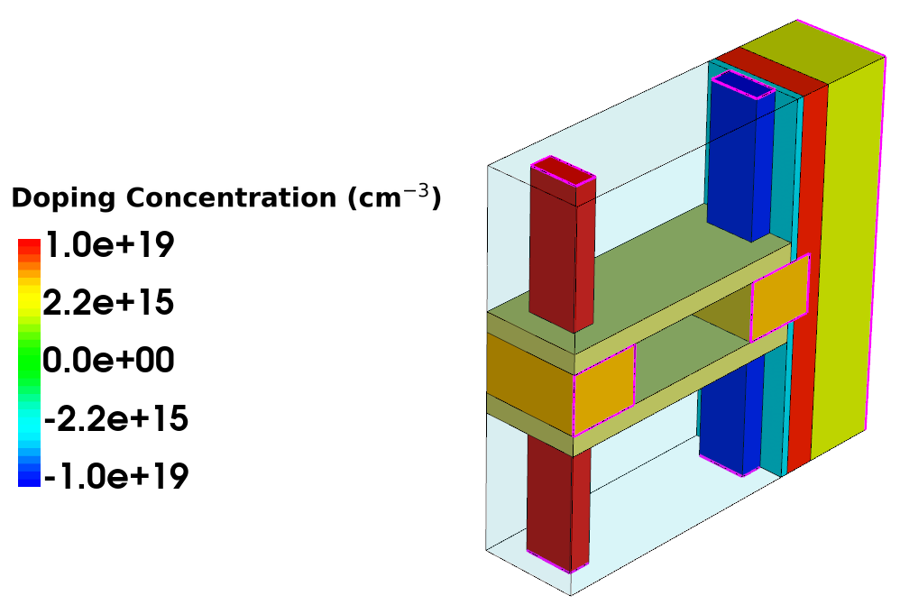
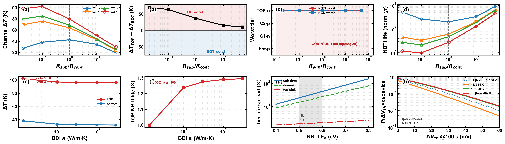

# The Invariant Reliability Bottleneck in Multi-Tier CFETs

**Cooling Topology, Tier Asymmetry, and Buried-Isolation Design**

**Status:** Manuscript under review — IEEE JXCDC (Journal on Exploratory Solid-State Computational Devices and Circuits)
**Authors:** Tushar Dudeja, Nawaz Shafi — Vellore Institute of Technology (VIT)

---

## Why this matters

Logic scaling is moving from single-tier FinFETs/GAAFETs to **Complementary FETs (CFETs)**, where an nFET and a pFET are stacked vertically to shrink footprint further. Stacking multiple CFET tiers on top of one another compounds the problem TCAD hasn't fully answered yet: each tier sits at a different self-heated temperature, degrades at a different rate under bias stress, and is cooled through a different thermal path to the substrate or the interconnect stack above it. This work asks a simple question with a non-obvious answer: **does the tier that fails first change depending on how you cool the die?**

## What we found

Using coupled electro-thermal-reliability TCAD simulation (Synopsys Sentaurus) of a 4-tier CFET stack, calibrated against an independently published 15 nm scaled CFET device:

- **The bottleneck tier is invariant, not topology-dependent.** The top tier runs hottest — and degrades fastest — across every cooling configuration tested, from substrate-dominant to top-dominant heat extraction (sink ratio swept 0.02–50). What *does* change with cooling topology is *how much* worse the top tier is: the tier-to-tier temperature spread compresses **6.8×** (from 71.3 K down to 10.6 K) as cooling shifts from substrate-dominant to top-dominant, without ever changing which tier is worst. **Architecture decides which tier limits reliability; cooling topology decides by how much.**
- **Per-tier aging degrades non-uniformly and predictably.** In a single self-consistent coupled simulation (not two isothermal runs compared after the fact), the top-tier pFET degrades **4.8–6.3×** faster than the bottom-tier pFET under NBTI, and the top-tier nFET degrades **2.3–2.8×** faster than the bottom-tier nFET under PBTI, depending on stress duration.
- **The degradation power-law exponent is tier-resolved, not a single number.** The exponent governing how damage accumulates over time decreases monotonically with tier temperature, at matched rates for both NBTI and PBTI (within 6% of each other) — three of four tiers land inside the 0.45–0.60 window independently reported for this device family.
- **Buried dielectric isolation (BDI) is a bounded, usable design lever.** Sweeping BDI thermal conductivity moves the worst-tier temperature by up to ~5.9 K before saturating — a real, quantifiable lever for designers, not a negligible effect.
- All same-mechanism tier ratios above were cross-validated against an independent literature dataset (top/bottom-tier nFET temperature agreement within 0.2–1%).

### Key results at a glance

| Metric | Value | Condition |
|---|---|---|
| Tier-asymmetry compression (substrate-dominant → top-dominant cooling) | **6.8×** (71.3 K → 10.6 K) | swept sink ratio 0.02–50 |
| Worst tier across all cooling topologies | Top tier, every case | 0/5 flips observed |
| NBTI degradation ratio, top vs. bottom pFET | **4.8×–6.3×** | 100 s–1000 s stress, self-consistent |
| PBTI degradation ratio, top vs. bottom nFET | **2.3×–2.8×** | 100 s–1000 s stress, self-consistent |
| Degradation power-law exponent, tier range | 0.51–0.66 | vs. literature window 0.45–0.60 |
| BDI thermal-conductivity design lever | up to **5.9 K** worst-tier shift | bounded, saturates |
| Cross-validation vs. independent literature (top-tier nFET T) | agreement within **0.2%** | like-for-like check |

## Method

- **Tool:** Synopsys Sentaurus TCAD (sde / sdevice / svisual), CLI batch mode.
- **Device:** 4-tier stacked CFET, calibrated to a published 15 nm scaled CFET (SS within 1.5 mV/dec of the reference calibration).
- **Approach:** rather than stitching together separate isothermal aging runs, the headline aging numbers come from a **single self-consistent coupled electro-thermal-reliability solve** — all four tiers, their mutual heating, and NBTI/PBTI degradation evolve together in one simulation, which also captures a small stabilizing feedback (degrading tiers draw less power, which lowers peak temperature by up to several K).
- Every number above was independently re-derived on a corrected simulation mesh and cross-checked against a control run reproducing the previously reported (and since superseded) result — the methodology and its correction trail are part of the manuscript.

## Figures

*3D device structure: 4-tier stacked CFET (p/n tiers), gate stack, buried dielectric isolation, and contacts.*

*Per-tier temperature and asymmetry vs. cooling topology, NBTI lifetime map, and BDI design-lever sweep.*

## My role

I designed and ran the full TCAD simulation campaign (device build, thermal calibration, cooling-topology sweep, self-consistent aging simulations), wrote the extraction and analysis pipeline, and identified and corrected a geometric meshing defect that had produced a spurious result in an earlier version of this work — the invariant-bottleneck finding above is the corrected, verified result.

## Skills demonstrated

TCAD device simulation (Synopsys Sentaurus) · semiconductor reliability physics (NBTI/PBTI, Arrhenius kinetics) · coupled electro-thermal simulation · Python-based data extraction and analysis · scientific writing and peer review response.

---

*This repository contains only a summary of published-pending results. Simulation decks, raw data, and unpublished manuscript text are not included while the manuscript is under review.*
